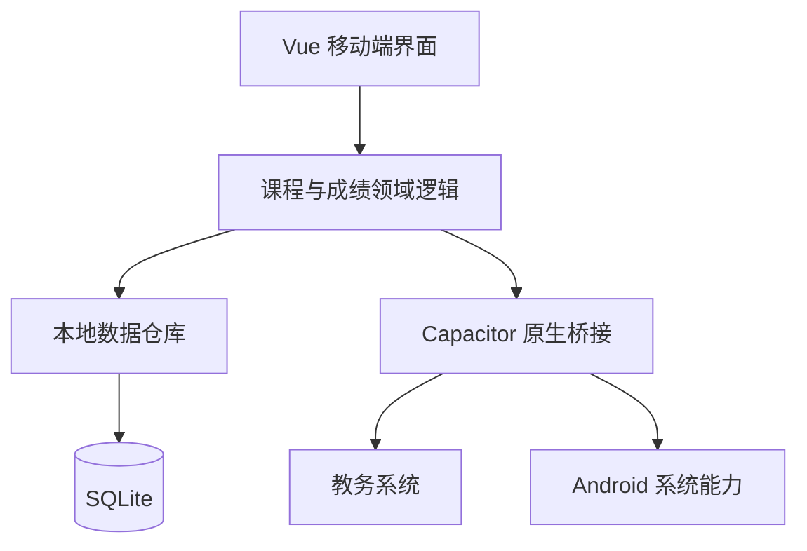

# 课序 1.0 架构方案

## 1. 产品边界

课序定位为武汉纺织大学外经贸学院学生使用的无广告、本地优先课表与成绩助手。

- 教务系统只用于用户主动导入课表或查询某学期成绩。
- 课程、成绩、同步记录和偏好设置默认只保存在设备本地。
- 不建设用户账号体系、不建设个人数据服务器、不上传教务系统账号或密码。
- Android 为主平台；iOS 保留 Capacitor 工程，但不作为当前功能迭代目标。

## 2. 信息架构

底部导航收敛为四个高频入口：

```text
首页
  下一节课
  今日安排
  完整课表入口

课表
  周网格 / 列表视图
  教学周选择
  课程详情、添加、编辑、删除

成绩
  学期成绩
  成绩统计
  分项成绩详情

我的
  导入课表
  查询成绩
  同步记录
  上课提醒
  数据导出与恢复
  外观与课程设置
  反馈、隐私、检查更新
```

同步记录不再作为一级导航；外观和低频配置统一放入“我的”。

## 3. 系统分层



### UI 层

- Vue 负责页面状态、组件交互和视图渲染。
- 首页只呈现下一节课、今日课程和快速入口，不承载完整课表。
- 课程网格、成绩列表、底部抽屉均从数据仓库读取，不直接访问教务系统。

### 领域层

- `ScheduleService`：课表导入、课程编辑、教学周过滤、结课判断、冲突检测。
- `GradeService`：学期缓存、成绩分页导入、分项成绩解析、学期删除。
- `ReminderService`：根据当天有效课程创建或取消本地提醒。
- `BackupService`：导出、恢复、迁移和数据校验。

### 原生桥接层

- `CapacitorHttp`：教务系统登录、课表和成绩请求。
- SQLite 插件：统一保存业务数据。
- Local Notifications：上课提醒。
- Filesystem / Share：导出和恢复备份。
- MainActivity 更新桥接：GitHub Release 检查、APK 下载和系统安装确认。

## 4. SQLite 数据模型

### courses

| 字段 | 说明 |
| --- | --- |
| id | 本地课程 ID |
| semester | 学期标识，例如 `2025-2026-2` |
| source_id | 教务系统课程或教学班 ID |
| name | 课程名 |
| teacher | 任课教师 |
| weekday | 星期 1-7 |
| start_section | 起始节次 |
| end_section | 结束节次 |
| weeks | 上课周次表达式 |
| location | 上课地点 |
| color | 课程颜色 |
| source | `school` 或 `manual` |
| updated_at | 更新时间 |

唯一约束：`semester + source_id + weekday + start_section + weeks`。

### grades

| 字段 | 说明 |
| --- | --- |
| id | 本地成绩 ID |
| semester | 学期标识 |
| course_code | 课程代码 |
| class_id | 教学班 ID |
| name | 课程名 |
| teacher | 教师 |
| score | 总评 |
| gpa | 绩点 |
| credit | 学分 |
| course_type | 课程性质 |
| exam_type | 考试性质 |
| imported_at | 导入时间 |

唯一约束：`semester + class_id`。没有教学班 ID 时使用 `semester + course_code + name`。

### grade_components

| 字段 | 说明 |
| --- | --- |
| id | 分项 ID |
| grade_id | 对应成绩 ID |
| label | 平时、期末、实验、总评等 |
| score | 分项分数 |
| weight | 占比 |

### sync_history

保存同步类型、学期、时间、课程或成绩条数、结果状态和快照版本。课程快照只保存必要字段，不保存账号密码。

### preferences

保存教学周、首页范围、主题、课程时长、提醒提前量和视觉风格等键值配置。

## 5. 关键业务规则

1. 查询同一学期成绩时，若本地已有该学期记录，默认展示本地结果；删除整个学期后才允许重新请求。
2. 课程冲突按“星期 + 节次重叠 + 周次相交”判断；只提醒，不强制阻止。
3. 结课状态按当前教学周是否落在课程周次内计算，不写死为导入时状态。
4. 账号与密码只存在于当前请求内存，查询结束即清空；学号可由用户选择是否记住。
5. 应用内更新只下载 GitHub Release 附件，并始终交由 Android 系统确认安装。

## 6. 实施顺序

### 阶段一：结构与数据基础

1. 四栏导航与“我的”页面收纳。
2. SQLite 接入、表结构、旧 localStorage 数据迁移。
3. 课程与成绩仓库接口替换现有直接 localStorage 读写。

### 阶段二：高频体验

1. 首页重构为下一节课、今日安排和完整课表入口。
2. 课程冲突检测、课程搜索与筛选。
3. 成绩列表紧凑化，详情展示分项成绩。

### 阶段三：留存与数据管理

1. 上课提醒。
2. 数据导出、恢复与清空。
3. 同步记录归档到“我的”。

### 阶段四：视觉收敛

1. 玻璃效果合并为“简洁 / 玻璃”一种选择。
2. 保留深浅色和强调色。
3. 降低预测返回和复杂回弹的维护优先级。

## 7. 验收标准

- 无网络时仍能查看已导入的课表、成绩和课程详情。
- 任何学期成绩只显示一份，且可以整学期删除后重新查询。
- 首页在一屏内显示下一节课和今日关键安排。
- 小屏 Android 设备上，顶部、弹窗和底部导航不遮挡内容。
- 更新、提醒、导出等系统操作都有清晰的权限说明与失败反馈。
